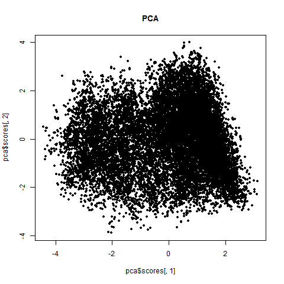
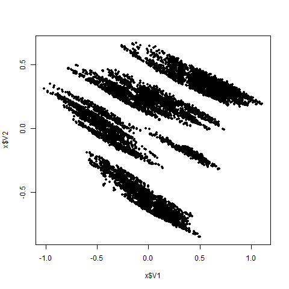

# Neural Principal Component Analysis

# The Model

It is based on the following neural network:

data => 2 PCs => 32 => 32 => data

The two 32-node layers act as nonlinear "decoder/intereptor" of the 2 PCs. But the 2 PCs are just linear projection of raw data. Thus the PCs have similar meanning with conventional PC, but due to the nonlinear intereptation, it can hold rich structural information of the raw data. Thus we can simply replace PCA with npca!
